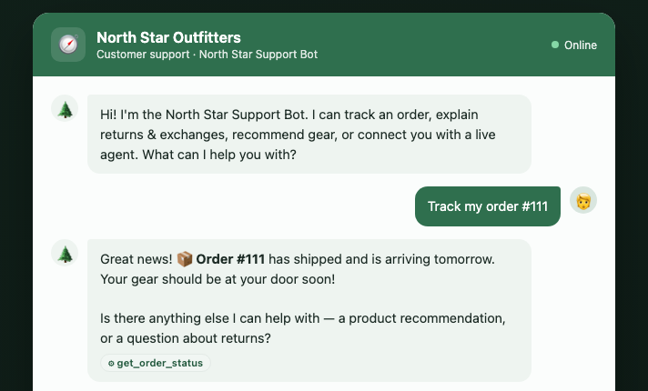

# North Star Outfitters — Customer-Support AI Chatbot

A custom LLM customer-support chatbot for **North Star Outfitters**, a small
e-commerce business selling outdoor apparel and camping gear to North American
adventurers. It handles the four support jobs the brief requires — **order
tracking, returns & exchanges, product recommendations, and human handoff** —
through a clean web chat UI backed by an LLM with real tool/function calling.

It's a from-scratch code build (not a no-code export): an Anthropic **Claude**
model drives the conversation and calls typed tools that read from a swappable
mock-data layer. Order statuses, the return policy, the returns link, and shipping
times all come from the provided data — the bot is instructed not to invent
anything.

<p align="center">
  
</p>

> Built for the Upwork *Talent Accelerator: AI Chatbot Developer* assignment, and
> as a portfolio piece demonstrating LLM tool-use integration.

---

## What it does

| # | Use case | How it works |
|---|----------|--------------|
| 1 | **Order tracking** | Asks for the order number, then returns the simulated status (`#111` shipped/arriving tomorrow, `#222` processing/ships in 24h, `#333` delivered; anything else is flagged invalid). |
| 2 | **Returns & exchanges** | Explains the 30-day / unused / original-packaging policy and provides the returns link. |
| 3 | **Product recommendations** | Asks 1–2 clarifying questions (season, conditions), then recommends a product **category**. |
| 4 | **Human handoff** | On an explicit request, frustration, or anything out of scope, transitions to a **Live Agent** with a captured summary and reference number. |

It also handles the functional requirements throughout: **intent recognition**
across phrasings ("Where is my order?" vs. "track my package"), **guided flows**
that return to the main menu after each resolution, and a clear **fallback**
("Sorry, I didn't quite catch that") that offers the four options or an agent.

---

## Architecture

```
Browser chat UI  (public/index.html)
        │  POST /api/chat { sessionId, message }
        ▼
Express server   (src/server.ts)  ── in-memory session store
        │
        ▼
Conversation     (src/agent.ts)   ── Anthropic Messages API + tool-use loop
        │                              keeps full message history per session
        ├── system prompt          (src/prompt.ts)  ◄── policies + shipping + link injected
        │
        ▼
Tool layer       (src/tools.ts)   ── 4 typed tools, JSON in / JSON out
        │
        ▼
Data layer       (src/data.ts)    ── reads /data/*.json  (← swap point)
```

**The tool-use loop** (`src/agent.ts`): each user message is sent to Claude with
the four tool definitions. If Claude returns `tool_use`, the server runs the tool
locally, feeds the JSON result back, and loops until Claude produces a final
natural-language reply. History is retained per `sessionId` so context carries
across turns.

**Grounding:** the return policy, shipping times, returns link, and product
categories are injected into the system prompt, and the bot is told to answer from
that source and the tools only — never to invent order statuses, policies, or
products.

### The four tools

| Tool | Use case | Purpose |
|------|----------|---------|
| `get_order_status` | Order tracking | Normalizes the order number and returns the simulated status; unknown numbers are invalid. |
| `get_return_info` | Returns & exchanges | Returns the policy, conditions, and the returns link; tailors the note to an order if given. |
| `recommend_category` | Recommendations | Scores the customer's need against the category catalog and returns the best category match(es). |
| `escalate_to_human` | Human handoff | Transitions to a Live Agent state with a reference number and captured context. |

### Project layout

```
.
├── data/                 # ← swappable mock data (the only files to replace)
│   ├── orders.json       #   official order logic (111 / 222 / 333)
│   ├── categories.json   #   product categories for recommendations
│   └── policies.json     #   business info, return/shipping policies, returns link, FAQs
├── public/
│   └── index.html        # web chat UI (self-contained)
├── src/
│   ├── types.ts          # shared domain types
│   ├── data.ts           # data-access + order-number normalization
│   ├── tools.ts          # tool definitions + executor
│   ├── prompt.ts         # system prompt (injects policies/shipping/link/categories)
│   ├── agent.ts          # Anthropic tool-use loop + per-session history
│   ├── env.ts            # loads .env.local then .env
│   ├── server.ts         # Express server + /api/chat
│   └── cli.ts            # optional terminal chat
├── .env.example
└── README.md
```

---

## Provided data (mock)

All responses are grounded in this provided data:

- **Order logic** (`data/orders.json`)
  - `#111` → **Shipped**, arriving tomorrow
  - `#222` → **Processing**, ships within 24 hours
  - `#333` → **Delivered** (bot asks a follow-up)
  - any other number → **invalid**
- **Return policy** — 30-day returns, items unused and in original packaging; start at the returns link.
- **Shipping** — Standard 3–5 business days; Expedited 1–2 business days.

---

## Setup & run

**Requirements:** Node.js 18+ and an [Anthropic API key](https://console.anthropic.com/settings/keys).

```bash
# 1. Install
npm install

# 2. Configure your key
cp .env.example .env       # or .env.local
#   then set ANTHROPIC_API_KEY=sk-ant-...

# 3. Run the web app
npm run dev                # http://localhost:3000  (auto-reload)
#   or:  npm start

# Optional: chat in the terminal instead
npm run cli
```

Open **http://localhost:3000** and use the suggested chips or type your own
message. No database, no deployment. `npm run typecheck` validates the TypeScript.

---

## Swapping in different data

The data layer is isolated. To change the store's data, **replace the JSON files
in `data/`** keeping the same shape — nothing else changes:

- `data/orders.json` — `orderNumber`, `status`, `statusDetail`, optional `followUpPrompt`.
- `data/categories.json` — `id`, `name`, `description`, `goodFor[]`, `examples[]`.
- `data/policies.json` — `business` info (incl. `returnsLink`), `policies[]` (injected into the prompt), and `faqs[]`.

If your real data lives in an API or database, implement the same functions
exported from `src/data.ts` (`findOrder`, `categories`, etc.) against your source —
the tools and agent are unaffected.

---

## Sample conversation

Real output from the included data (the bot's wording varies naturally; tool calls
and data are exact).

**Intent recognition + Order tracking**

> **You:** track my package
> **Bot:** I'd be happy to track your package for you. Can you share your **order number**? It's usually in your confirmation email (it might look like #111, 222, order 333…).
> **You:** #111
> **Bot:** **Order #111** has shipped and is arriving tomorrow. Your gear should be at your door soon! Is there anything else I can help with — a product recommendation, or a question about returns?
> *⚙ get_order_status*

**Returns & exchanges**

> **You:** what's your return policy
> **Bot:** Here's the rundown: **30-day window** from purchase · items must be **unused and in original packaging** · start your return anytime at https://northstaroutfitters.example/returns — we'll email a prepaid label and refund once we receive the item. Exchanges work the same way. Are you looking to return something, or just checking the policy?
> *⚙ get_return_info*

**Product recommendations (clarify → recommend a category)**

> **You:** I'm looking for a jacket
> **Bot:** Let me ask a couple of quick questions: what season/weather will you use it in, and what conditions — cold & dry, wet & rainy, windy, mixed?
> **You:** something warm for winter hiking
> **Bot:** For winter hiking I'd point you to **Insulated Jackets** — warm down or synthetic puffers for cold, dry conditions (e.g. down jackets, synthetic puffers, insulated parkas). If you also expect wet snow or wind, pair them with a **Rain Shell**. Want me to narrow it down further?
> *⚙ recommend_category*

**Delivered order (follow-up)**

> **You:** can you check order 333
> **Bot:** **Order #333** has been delivered. 📦 Did everything arrive in good condition? If you need to return or exchange anything, I'm here to help.
> *⚙ get_order_status*

**Fallback**

> **You:** asdf qwerty zzz
> **Bot:** Sorry, I didn't quite catch that! Here's what I can help with: **1) Order tracking · 2) Returns & exchanges · 3) Product recommendations · 4) Talk to a live agent.** What can I do for you?

**Human handoff (Live Agent)**

> **You:** just connect me to a live agent
> **Bot:** I'm connecting you with a live agent now. Your reference is **LA-0046**. Our team is available Monday–Friday, 8am–6pm Mountain Time, or email support@northstaroutfitters.example.
> *⚙ escalate_to_human* · 👤 *Connected to a Live Agent*

**Invalid order**

> **You:** where is order 999
> **Bot:** I couldn't find an order with number **999**. Valid sample orders are **111, 222, and 333** — please double-check and I'll pull up the status.
> *⚙ get_order_status*

---

## Demo video

A ready-to-record 2–3 minute walkthrough — covering all four use cases **and** a
fallback scenario, as the brief requires — is in **[DEMO_SCRIPT.md](DEMO_SCRIPT.md)**.

---

## Tech

TypeScript · Node.js · Express · Anthropic Claude (Messages API + tool use) ·
vanilla HTML/CSS/JS UI. Run with [`tsx`](https://github.com/privatenumber/tsx) —
no build step. Secrets via `.env` / `.env.local` (never committed).

## License

MIT
